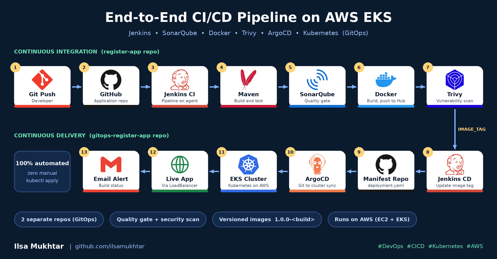
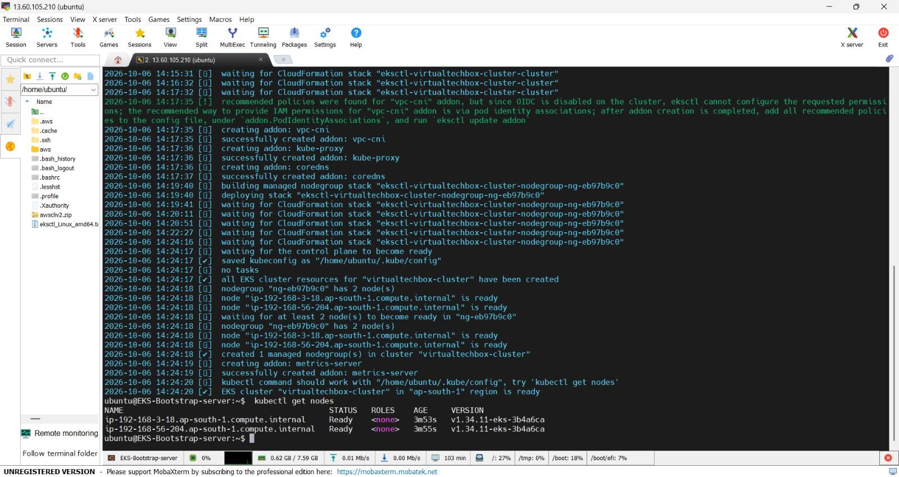
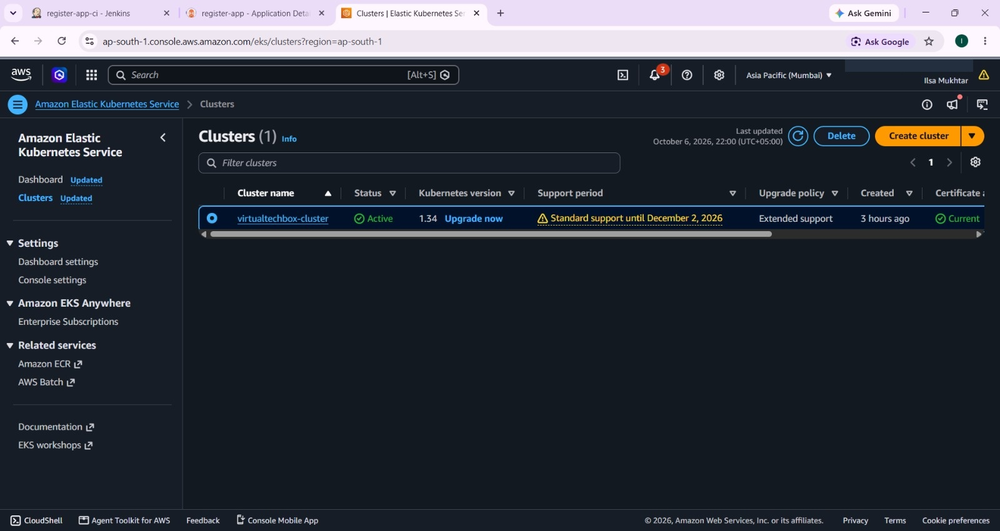
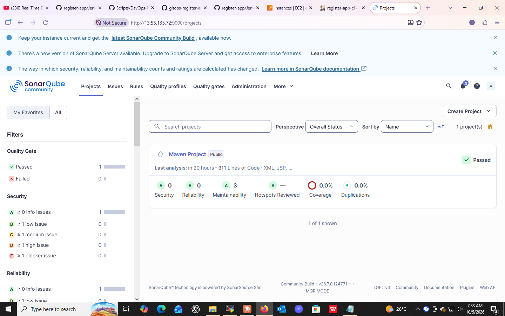
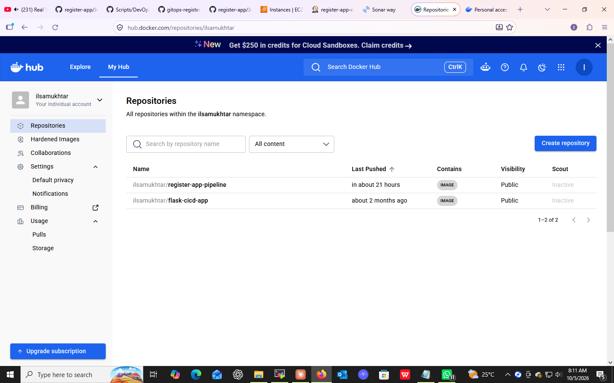
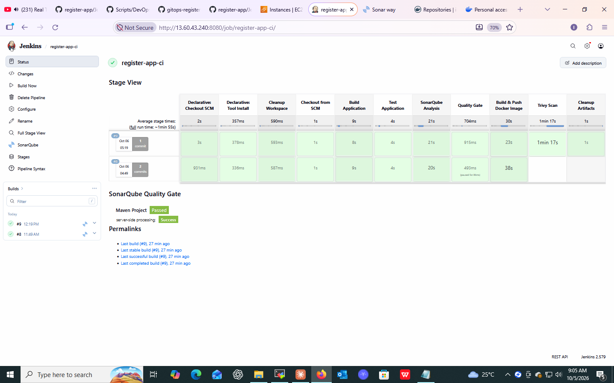
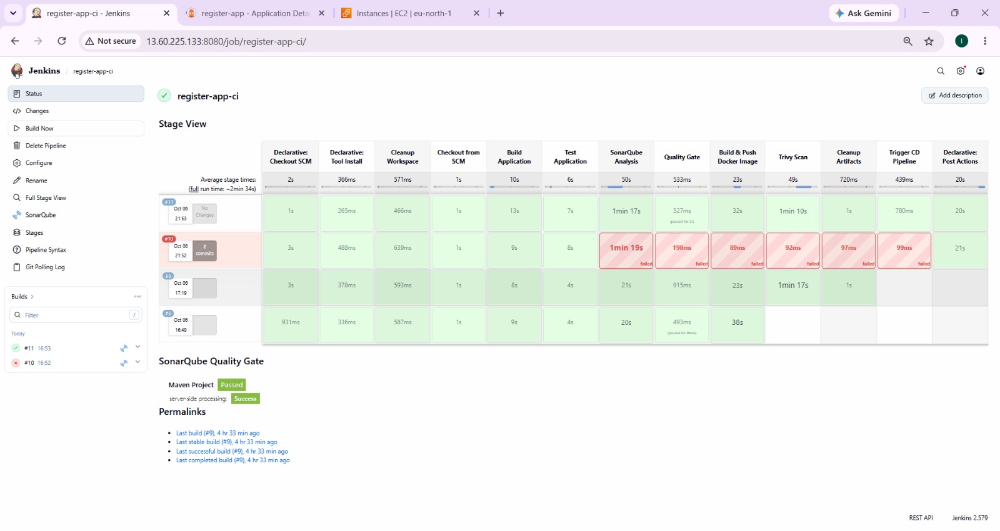
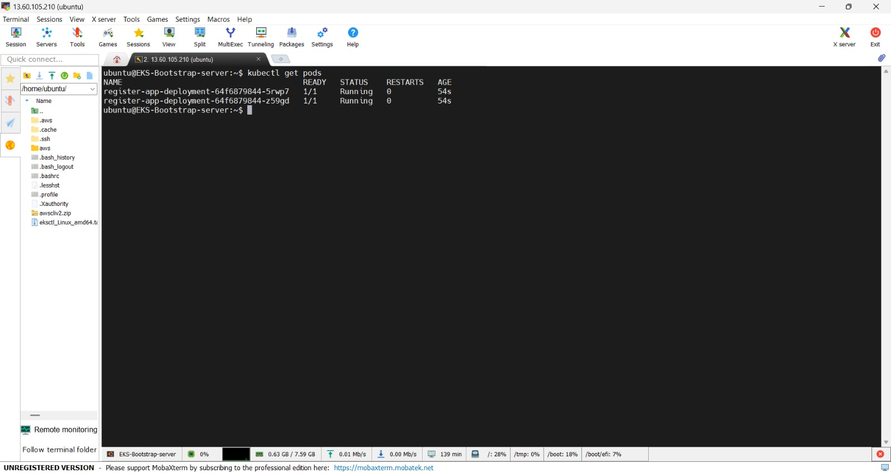

# register-app: End-to-End CI/CD Pipeline with Jenkins, SonarQube, Trivy, ArgoCD and AWS EKS



A complete **DevSecOps CI/CD pipeline** that takes a Java (Maven) web application from a `git push` all the way to a running deployment on **Amazon EKS** using a **GitOps** workflow.

This repository holds the **application source code, Dockerfile and CI pipeline (Jenkinsfile)**.
The Kubernetes manifests and the CD pipeline live in a separate repository:
**[gitops-register-app](https://github.com/ilsamukhtar/gitops-register-app)**.

---

## Table of Contents

1. [Why two repositories?](#why-two-repositories)
2. [Architecture and workflow](#architecture-and-workflow)
3. [Tech stack](#tech-stack)
4. [Repository structure](#repository-structure)
5. [CI pipeline stages](#ci-pipeline-stages)
6. [Infrastructure setup](#infrastructure-setup)
7. [Results and screenshots](#results-and-screenshots)
8. [How to reproduce](#how-to-reproduce)
9. [Key learnings](#key-learnings)
10. [Future improvements](#future-improvements)
11. [Acknowledgements](#acknowledgements)

---

## Why two repositories?

This project follows the GitOps best practice of separating **application code** from **deployment configuration**.

| Repository | Purpose |
|---|---|
| **register-app** (this repo) | Application code, `Dockerfile`, CI `Jenkinsfile` |
| [gitops-register-app](https://github.com/ilsamukhtar/gitops-register-app) | Kubernetes manifests (`deployment.yaml`, `service.yaml`) and CD `Jenkinsfile` |

Benefits: a code change never directly touches the cluster configuration, deployments are fully auditable in Git history, and ArgoCD only needs to watch the manifest repository.

## Architecture and workflow

1. A developer pushes code to this repository.
2. The **Jenkins CI job** (`register-app-ci`) runs on a dedicated Jenkins agent.
3. **Maven** builds and tests the application.
4. **SonarQube** performs static code analysis and checks the Quality Gate.
5. A **Docker image** is built and pushed to **Docker Hub** with a version tag (`1.0.0-<build number>`).
6. **Trivy** scans the image for HIGH and CRITICAL vulnerabilities.
7. Local images are cleaned up, then Jenkins triggers the **CD job** (`gitops-register-app-cd`) and passes the new image tag.
8. The CD job updates `deployment.yaml` in the manifest repository.
9. **ArgoCD** detects the Git change and syncs it to the **EKS cluster**.
10. Jenkins sends an email notification with the build result.

## Tech stack

| Area | Tools |
|---|---|
| Source control | Git, GitHub |
| CI/CD | Jenkins (master and agent) |
| Build and test | Maven, JDK 17 |
| Code quality | SonarQube (PostgreSQL backend) |
| Containers | Docker, Docker Hub |
| Security scanning | Trivy |
| GitOps | ArgoCD |
| Orchestration | Kubernetes on Amazon EKS (`eksctl`) |
| Cloud | AWS EC2, EKS, CloudFormation |

## Repository structure

```
register-app/
├── server/          # Application server module
├── webapp/          # Web application module
├── Dockerfile       # Container image definition
├── Jenkinsfile      # CI pipeline definition
├── pom.xml          # Maven build configuration
└── docs/images/     # Screenshots used in this README
```

## CI pipeline stages

Defined in the [`Jenkinsfile`](Jenkinsfile):

| # | Stage | What it does |
|---|---|---|
| 1 | Cleanup Workspace | Starts every build from a clean workspace |
| 2 | Checkout from SCM | Pulls the latest code from GitHub |
| 3 | Build Application | `mvn clean package` |
| 4 | Test Application | `mvn test` |
| 5 | SonarQube Analysis | Static code analysis with the Sonar Maven plugin |
| 6 | Quality Gate | Waits for the SonarQube Quality Gate result |
| 7 | Build and Push Docker Image | Builds the image and pushes `1.0.0-<build>` and `latest` tags to Docker Hub |
| 8 | Trivy Scan | Scans the image for HIGH and CRITICAL vulnerabilities |
| 9 | Cleanup Artifacts | Removes local images from the agent |
| 10 | Trigger CD Pipeline | Calls the CD job and passes `IMAGE_TAG` |

Post actions: an HTML email is sent on both success and failure.

## Infrastructure setup

Everything runs on AWS:

- **Jenkins master and agent** on EC2 (Ubuntu, OpenJDK 17)
- **SonarQube** on EC2 with a PostgreSQL database
- **EKS bootstrap server** with AWS CLI, `kubectl` and `eksctl`
- **EKS cluster** created with `eksctl` (2 x `t3.medium` nodes in `ap-south-1`)
- **ArgoCD** installed in the `argocd` namespace and exposed with a LoadBalancer

Cluster creation with `eksctl` (CloudFormation provisions the control plane and managed node group). Both worker nodes reach the `Ready` state:



The cluster as seen in the AWS console:



## Results and screenshots

### SonarQube code analysis: Quality Gate passed



### Docker image published to Docker Hub



### CI pipeline with SonarQube Quality Gate, Docker build and Trivy scan



### Complete CI pipeline including the CD trigger



### ArgoCD application synced and healthy


### Pods running on EKS



### Application running on EKS


## How to reproduce

**Prerequisites:** an AWS account, a Docker Hub account, a GitHub account, and three or four EC2 instances (Ubuntu).

1. **Jenkins:** install OpenJDK 17 and Jenkins on the master, then configure a second EC2 instance as a Jenkins agent with the label `Jenkins-Agent`. Install Docker and Maven tooling on the agent.
2. **SonarQube:** install PostgreSQL and SonarQube, create a project token and add it to Jenkins as the credential `jenkins-sonarqube-token`.
3. **Credentials in Jenkins:** `github`, `dockerhub`, `jenkins-sonarqube-token` and `JENKINS_API_TOKEN`.
4. **Tools in Jenkins:** JDK named `Java17` and Maven named `Maven3`.
5. **EKS:** on the bootstrap server install AWS CLI, `kubectl` and `eksctl`, then:
   ```bash
   eksctl create cluster --name virtualtechbox-cluster \
     --region ap-south-1 --node-type t3.medium --nodes 2
   ```
6. **ArgoCD:**
   ```bash
   kubectl create namespace argocd
   kubectl apply -n argocd --server-side --force-conflicts \
     -f https://raw.githubusercontent.com/argoproj/argo-cd/stable/manifests/install.yaml
   kubectl patch svc argocd-server -n argocd -p '{"spec": {"type": "LoadBalancer"}}'
   ```
   Then create an ArgoCD application that points to the [manifest repository](https://github.com/ilsamukhtar/gitops-register-app).
7. Create the Jenkins job `register-app-ci` (Pipeline from SCM) for this repository and run it.

> **Cost note:** EKS and EC2 are billed hourly. Delete the cluster when you are done:
> `eksctl delete cluster --name virtualtechbox-cluster --region ap-south-1`

## Key learnings

- Designing a multi-stage CI pipeline with a quality gate and a security scan.
- Separating application code from deployment configuration (GitOps).
- Automating image versioning so every build is traceable to a Git commit and an image tag.
- Provisioning and operating a Kubernetes cluster on AWS with `eksctl`.
- Troubleshooting Jenkins agents, credentials, SonarQube tokens and Docker permissions.

## Future improvements

- Fail the pipeline on CRITICAL vulnerabilities (Trivy is currently report-only).
- Enforce the SonarQube Quality Gate (abort on failure) and add unit-test coverage.
- Add Slack notifications alongside email.
- Add an Ingress controller with HTTPS, and move to Helm charts.
- Provision the infrastructure with Terraform.
- Add monitoring with Prometheus and Grafana.

## Acknowledgements

Built while learning from the *Real Time DevOps Project: Deploy to Kubernetes Using Jenkins* tutorial by Virtual TechBox. The pipeline, repositories, infrastructure and troubleshooting were set up and run hands-on in my own AWS account.

## Author

**Ilsa Mukhtar**: DevOps enthusiast
GitHub: [@ilsamukhtar](https://github.com/ilsamukhtar)
